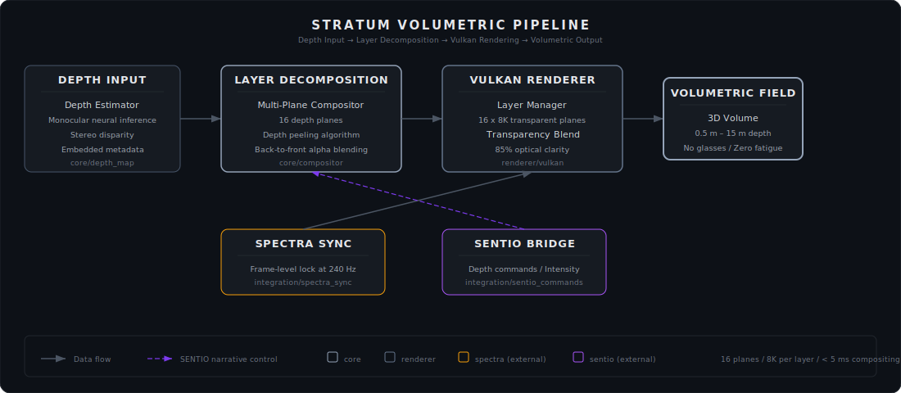

<div align="center">


### The Aether Layer

**Volumetric Display System**

<br/>

[](https://github.com/sylvain-cinema/stratum/actions/workflows/ci.yml)
[](LICENSE)
[](https://isocpp.org)
[](https://www.vulkan.org)
[](https://sylvain-cinema.github.io)

<br/>

*Multi-plane transparent display compositing for glasses-free volumetric 3D.*
*Visual elements exist in true 3D space between screen and audience.*
*No glasses. No fatigue. Pure cinematic depth.*

</div>

<br/>

---

<br/>

## Overview

STRATUM creates depth fields where visual elements exist in true 3D space between the SPECTRA display and the audience. Using transparent display layers synchronized at frame level with SPECTRA's MicroLED canvas, it delivers glasses-free volumetric imagery with no headaches and no fatigue.

<br/>

## Key Specifications

<table>
<tr><td><strong>Depth Planes</strong></td><td>16 planes of volumetric depth</td></tr>
<tr><td><strong>Resolution per Layer</strong></td><td>8K (7680 × 4320)</td></tr>
<tr><td><strong>Transparency</strong></td><td>85% optical clarity</td></tr>
<tr><td><strong>Eye Strain</strong></td><td>0° vergence conflict (zero fatigue)</td></tr>
<tr><td><strong>Glasses Required</strong></td><td>None</td></tr>
<tr><td><strong>Compositing Latency</strong></td><td>&lt;5 ms</td></tr>
<tr><td><strong>Depth Range</strong></td><td>0.5 m – 15 m perceived depth</td></tr>
<tr><td><strong>Rendering</strong></td><td>Vulkan / Metal compute pipeline</td></tr>
</table>

<br/>

## Architecture

<div align="center">



</div>
<br/>

## Modules

| Module | Description |
|:-------|:------------|
| **`core`** | Volumetric engine · Multi-plane compositor · Depth estimation |
| **`renderer`** | Vulkan rendering backend · Layer management · Transparency blending |
| **`integration`** | SPECTRA synchronization · SENTIO command handling |
| **`calibration`** | Layer-to-screen alignment · Parallax correction |

<br/>

## Building

```bash
mkdir build && cd build
cmake .. -DCMAKE_BUILD_TYPE=Release
cmake --build . --parallel
```

<br/>

## Sylvain Ecosystem

<table>
<tr><td><a href="https://github.com/sylvain-cinema/spectra"><strong>spectra</strong></a></td><td>16K MicroLED Display Engine</td></tr>
<tr><td><a href="https://github.com/sylvain-cinema/sonora"><strong>sonora</strong></a></td><td>Wave Field Synthesis Audio Engine</td></tr>
<tr><td><a href="https://github.com/sylvain-cinema/sentio"><strong>sentio</strong></a></td><td>Empathic AI Narrative Intelligence</td></tr>
<tr><td><strong>stratum</strong></td><td>Volumetric Display System</td><td><em>← you are here</em></td></tr>
<tr><td><a href="https://github.com/sylvain-cinema/sylvain-sdk"><strong>sylvain-sdk</strong></a></td><td>Unified Developer SDK</td></tr>
<tr><td><a href="https://github.com/sylvain-cinema/sylvain.github.io"><strong>docs</strong></a></td><td>Developer Documentation</td></tr>
</table>

<br/>

## License

Licensed under the [Apache License, Version 2.0](LICENSE).

<br/>

---

<div align="center">
<br/>


<sub>Every Seat is the Best Seat</sub>

</div>
