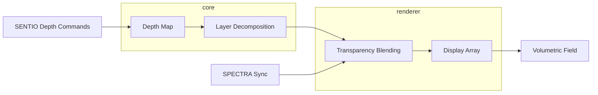

<](https://github.com/sylvain-cinema/stratum/actions)
[](LICENSE)

*Multi-plane transparent display compositing for glasses-free volumetric 3D imagery.*

</div>

---

## Overview

STRATUM creates depth fields where visual elements exist in true 3D space between the screen and audience. Using transparent display layers synchronized with SPECTRA's MicroLED canvas, it delivers glasses-free volumetric imagery — no headaches, no fatigue, pure cinematic depth.

### Key Specifications

| Parameter | Value |
|-----------|-------|
| Display Layers | Multi-plane transparent OLED/MicroLED |
| Depth Range | 0.5m – 15m perceived depth |
| Compositing Latency | <5ms |
| Transparency | >85% optical clarity |
| Integration | Synchronized with SPECTRA at frame level |
| Rendering | Vulkan/Metal compute pipeline |

## Architecture



## Modules

| Module | Description |
|--------|-------------|
| `core` | Volumetric engine, multi-plane compositor, depth estimation |
| `renderer` | Vulkan rendering backend, layer management, transparency blending |
| `integration` | SPECTRA synchronization and SENTIO command handling |
| `calibration` | Layer-to-screen alignment, parallax correction |

## Building

```bash
mkdir build && cd build
cmake .. -DCMAKE_BUILD_TYPE=Release
cmake --build . --parallel
```

## Sylvain Ecosystem

| Repository | Description |
|-----------|-------------|
| [spectra](https://github.com/sylvain-cinema/spectra) | 16K MicroLED Display Engine |
| [sonora](https://github.com/sylvain-cinema/sonora) | Wave Field Synthesis Audio Engine |
| [sentio](https://github.com/sylvain-cinema/sentio) | Empathic AI Narrative Intelligence |
| **stratum** (this repo) | Volumetric Display System |
| [sylvain-sdk](https://github.com/sylvain-cinema/sylvain-sdk) | Unified Developer SDK |

## License

Apache License 2.0. See [LICENSE](LICENSE).

---

<div align="center">
<strong>SYLVAIN</strong> — The Future of Cinematic Storytelling
</div>
]]>